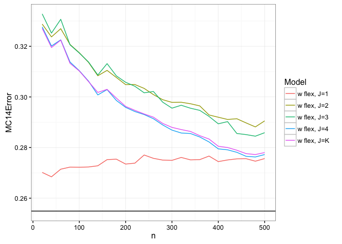

    ###Prerequisite
    ###Install the package if you haven't
    setwd("~/git/")
    require('devtools')
    build('jkmeans')
    install.packages("jkmeans_1.0.tar.gz", repos = NULL, type = "source")

### 1. Generate Data

Let's generate data:

``` r
n<- 100
K<- 5
p<- 1
batchN<- 1000

yBatch<- array(0,dim = c(n*K,p,batchN))

mu0<- c(1:K)
mu<- matrix( 0,n*K,p)
mu <- rep(mu0, each = n)
sigma<-  0.5

for(b in 1:batchN){
  yBatch[,,b]<- matrix( rnorm(n*p*K,mu,sigma), n*K, p)
}

mu_ini<- matrix(mu0,K,p)
```

Here is a view of the two clusters

``` r
dataHist<- data.frame("Mu"=as.factor(mu),    "y"= yBatch[,,1])

ggplot(dataHist, aes(y, fill = as.factor(Mu))) + geom_histogram(alpha = 0.2,bins = 30,  position="identity")
```


functions to compute misclassification error and rmse of mean estimate: NB: GMM can get stuck in saddle point at (w1=0, w2=1), so I removed the test result when it happened.

``` r
computeMError<- function(jk, n,batchN){
  error<- numeric(batchN)
  for(b in 1:batchN){
    tM0<- rank(jk$mu[,1,b])-1
    trueM<- rep(tM0,each=n)
    error[b]<- sum ( jk$M[,b] != trueM) /K/n
    if( min(jk$w[,b])<0.01){
      error[b]<- NA
    }
  }
  error
}

computeRMSE<- function(jk, mu0, batchN){
  rmse<- numeric(batchN)
  for(b in 1:batchN){
    newOrder<- order(jk$mu[,1,b],decreasing = F)
    
    muEst<-as.matrix(jk$mu[,,b])[newOrder,]
    
    rmse[b]<- sqrt( mean((muEst - mu0)^2))
    if( min(jk$w[,b])<0.01)
      rmse[b]<- NA
  }
  rmse
}
```

### 2. Test jk-means/ j-sparse-GMM with different n's

``` r
experiment<- function(n){
  
  p<- 1
  batchN<- 1000
  
  yBatch<- array(0,dim = c(n*K,p,batchN))
  
  mu0<- c(1:K)
  mu<- matrix( 0,n*K,p)
  mu <- rep(mu0, each = n)
  
  for(b in 1:batchN){
    yBatch[,,b]<- matrix( rnorm(n*p*K,mu,sigma), n*K, p)
  }
  
  mu_ini<- matrix(mu0,K,p)
  
  
  jk1 <- jkmeans::jkmeansEMBatch(yBatch, k=K, j = 1,  1000,tol = 1E-10,useKmeansIni = F, meansIni = mu_ini, fixW = T,sigma2_ini = sigma^2)
  jk2 <- jkmeans::jkmeansEMBatch(yBatch, k=K, j = 2,  1000,tol = 1E-10,useKmeansIni = F, meansIni = mu_ini, fixW = T,sigma2_ini = sigma^2)
  jk3 <- jkmeans::jkmeansEMBatch(yBatch, k=K, j = 3,  1000,tol = 1E-10,useKmeansIni = F, meansIni = mu_ini, fixW = T,sigma2_ini = sigma^2)
  jk4 <- jkmeans::jkmeansEMBatch(yBatch, k=K, j = 4,  1000,tol = 1E-10,useKmeansIni = F, meansIni = mu_ini, fixW = T,sigma2_ini = sigma^2)
  jkK <- jkmeans::jkmeansEMBatch(yBatch, k=K, j = K,  1000,tol = 1E-10,useKmeansIni = F, meansIni = mu_ini, fixW = T,sigma2_ini = sigma^2)
  
  
  jGMM1 <- jkmeans::jkmeansEMBatch(yBatch, k=K, j = 1,  1000,tol = 1E-10,useKmeansIni = F, meansIni = mu_ini, fixW = F,sigma2_ini = sigma^2)
  jGMM2 <- jkmeans::jkmeansEMBatch(yBatch, k=K, j = 2,  1000,tol = 1E-10,useKmeansIni = F, meansIni = mu_ini, fixW = F,sigma2_ini = sigma^3)
  jGMM3 <- jkmeans::jkmeansEMBatch(yBatch, k=K, j = 3,  1000,tol = 1E-10,useKmeansIni = F, meansIni = mu_ini, fixW = F,sigma2_ini = sigma^2)
  jGMM4 <- jkmeans::jkmeansEMBatch(yBatch, k=K, j = 4,  1000,tol = 1E-10,useKmeansIni = F, meansIni = mu_ini, fixW = F,sigma2_ini = sigma^2)
  jGMMK <- jkmeans::jkmeansEMBatch(yBatch, k=K, j = K,  1000,tol = 1E-10,useKmeansIni = F, meansIni = mu_ini, fixW = F,sigma2_ini = sigma^2)
  
  runRes <- list(jk1,jk2,jk3,jk4,jkK, jGMM1, jGMM2, jGMM3, jGMM4, jGMMK)
  
  error<- sapply(runRes,function(x){computeMError(x,n,batchN)})
  rmse<- sapply(runRes,function(x){computeRMSE(x,mu0,batchN)})
  
  list("MCE"=error, "RMSE"=rmse)
  
}
```

``` r
#code to run on an increasing series of n
#ran on cluster

nSeries<- c(seq(20,500,by = 20))

if(FALSE)
{
  
  MCEmean<- numeric()
  MCEq25<- numeric()
  MCEq975<- numeric()
  RMSEmean<- numeric()
  RMSEq25<- numeric()
  RMSEq975<- numeric()
  
  
  for(n in nSeries){
    test<-experiment(n)
    
    MCEmean <- rbind(MCEmean,colMeans(test$MCE,na.rm = T))
    MCEq25 <- rbind(MCEq25, apply(test$MCE, MARGIN = 2, function(x){quantile(x,probs = 0.025,na.rm = T)}))
    MCEq975 <- rbind(MCEq975, apply(test$MCE, MARGIN = 2, function(x){quantile(x,probs = 0.975,na.rm = T)}))
    
    RMSEmean<- rbind(RMSEmean, colMeans(test$RMSE,na.rm = T))
    RMSEq25<- rbind(RMSEq25, apply(test$RMSE, MARGIN = 2, function(x){quantile(x,probs = 0.025,na.rm = T)}))
    RMSEq975<-  rbind(RMSEq975, apply(test$RMSE, MARGIN = 2, function(x){quantile(x,probs = 0.975,na.rm = T)}))
    
    print(n)
  }
  
  
  result<- list("MCEmean"=MCEmean,
                "MCEq25"=MCEq25,
                "MCEq975"=MCEq975,
                "RMSEmean"=RMSEmean,
                "RMSEq25"=RMSEq25,
                "RMSEq975"=RMSEq975)
  
  save(result, file="resultRatesBigK.Rda")
}
```

Misclassification error
=======================

plot without & with pointwise 95% confidence band


RMSE for the mean estimate
==========================

plot without & with pointwise 95% confidence band




