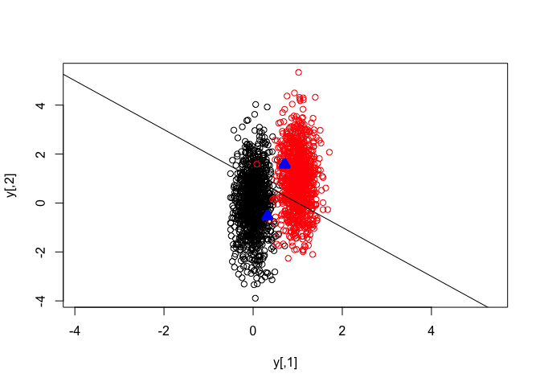

``` r
kemans_test(1,5)
```

I

    ## [1] 0.0435

``` r
kemans_test(1,10)
```


    ## [1] 0.1515

``` r
kemans_test(1,20)
```


    ## [1] 0.267

``` r
kemans_test(1,30)
```



    ## [1] 0.3155

``` r
kemans_test(1,40)
```


    ## [1] 0.3535

``` r
kemans_test(1,100)
```


    ## [1] 0.4005

``` r
kemans_test(1,1000)
```


    ## [1] 0.466

``` r
kemans_test(2,5)
```


    ## [1] 0.0075

``` r
kemans_test(2,10)
```


    ## [1] 0.042

``` r
kemans_test(5,1000)
```


    ## [1] 0.3705
