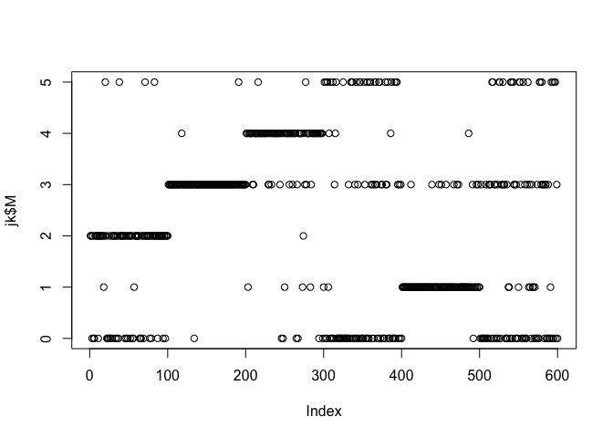

``` r
# .rs.restartR()
setwd("~/git/jkmeans/test/")
source("kmpp.r")
require("jkmeans")
```

    ## Loading required package: jkmeans

    ## 
    ## Attaching package: 'jkmeans'

    ## The following object is masked _by_ '.GlobalEnv':
    ## 
    ##     kmpp

``` r
require("mclust")
```

    ## Loading required package: mclust

    ## Package 'mclust' version 5.2

    ## Type 'citation("mclust")' for citing this R package in publications.

``` r
mnist<- read.csv("../mnist_data/mnist.csv",header = F)

pick<- c(0:5)
p<- 28^2


n<-100
s<- sample(1:1000,n,replace = F)

subset<- c(sapply(pick*1000, function(x){x+ s}))
mnist_subset<- mnist[,subset]
Y<-t(mnist_subset)
Y<- Y/255
K<- length(pick)


gmm<- jkmeansEM(Y,k = K,useKmeansIni = T,meansIni = matrix(rnorm(K*p),nrow = K),sigma2_ini = 0.1,fixW = F,tau = 1,steps = 1000)

jk<- jkmeansEM(Y,k = K,useKmeansIni = T,meansIni = matrix(rep(1,K*p),nrow = K),sigma2_ini = 0.1,fixW = F,tau = 1000)


kmeans <- jkmeansEM(Y,k = K,useKmeansIni = T,meansIni = matrix(rep(1,K*p),nrow = K),sigma2_ini = 0.1,fixW = T,tau = 1000)


M<- rep(pick,each=n)

adjustedRandIndex(jk$M,M)
```

    ## [1] 0.4369207

``` r
adjustedRandIndex(gmm$M,M)
```

    ## [1] 0.4337515

``` r
adjustedRandIndex(kmeans$M,M)
```

    ## [1] 0.4369207

``` r
plot(jk$M)
```


